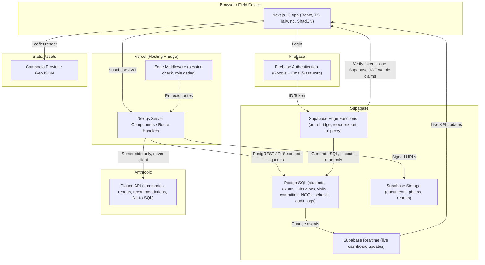
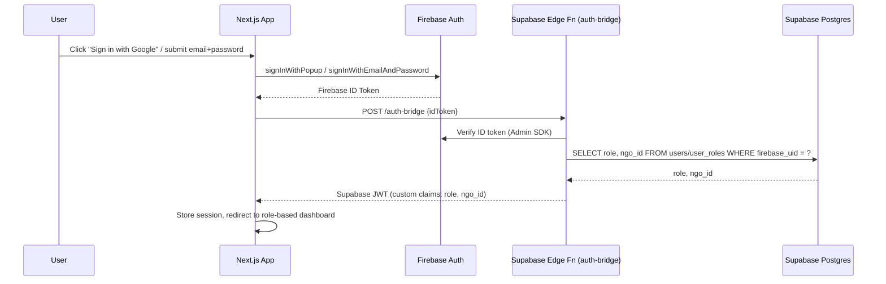
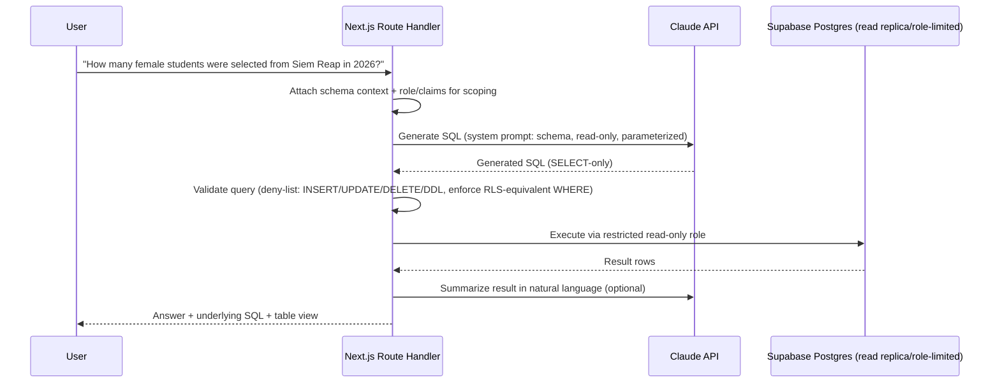
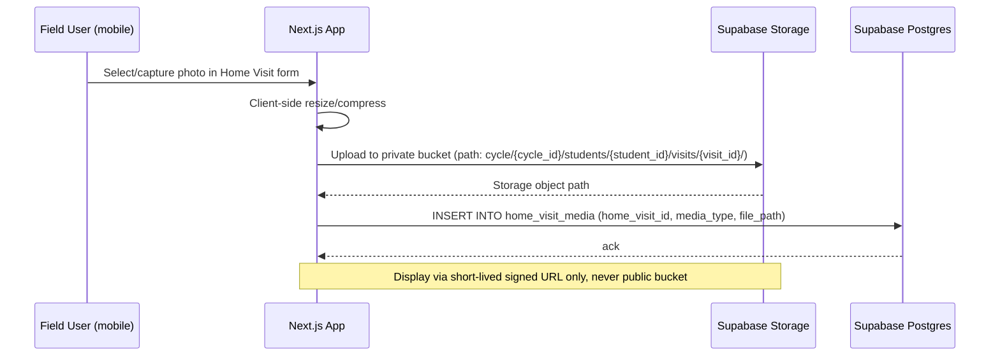

# System Architecture

## 1. High-Level Architecture

## 2. Component Responsibilities

| Component | Responsibility |
|---|---|
| **Next.js App (Vercel)** | UI rendering, server actions/route handlers, RBAC route gating, calls to Supabase via server-side client (service operations) and client SDK (read-mostly with RLS) |
| **Firebase Authentication** | Identity provider — Google OAuth + Email/Password, issues Firebase ID tokens |
| **Auth Bridge (Supabase Edge Function)** | Verifies Firebase ID token (Firebase Admin SDK), looks up the user's role(s) and NGO scope in Postgres, mints a Supabase-compatible JWT with custom claims (`role`, `ngo_id`, `firebase_uid`) signed with the Supabase JWT secret |
| **Supabase Postgres** | System of record — all relational data, RLS policies enforce row visibility per role/claims |
| **Supabase Storage** | Student documents, ID cards, transcripts, certificates, home visit photos/reports — private buckets, signed URL access only |
| **Supabase Edge Functions** | Server-side jobs: auth bridge, report generation (PDF/Excel), AI proxy (keeps the Claude API key off the client), scheduled aggregation refresh |
| **Claude API** | All 4 AI features — always invoked server-side (Edge Function or Next.js Route Handler), never directly from the browser |
| **React Leaflet + GeoJSON** | Client-side Cambodia province choropleth map; province polygons from static GeoJSON, student metrics joined from Supabase at render time |
| **Vercel** | Hosting, CI/CD, edge middleware for auth/role gating, environment/secret management |

## 3. Why a Firebase → Supabase Auth Bridge

The stack specifies Firebase Authentication for login but Supabase Postgres/RLS for authorization. Supabase RLS natively expects a JWT it can verify (so `auth.jwt()` works in policies). Rather than running a custom token-minting service, this design uses **Supabase Third-Party Auth**, which lets a Supabase project trust and directly verify Firebase ID tokens (via Firebase's public JWKS) with no shared-secret signing step:

1. Client signs in with Firebase (Google or Email/Password) → receives a Firebase ID token.
2. The Supabase project is configured (Dashboard → Authentication → Third-Party Auth) to trust the Firebase project as an external JWT issuer.
3. Role and NGO scope are carried as **Firebase custom claims** (`role`, `ngo_id`), set server-side via the Firebase Admin SDK (`setCustomUserClaims`) whenever an admin assigns/changes a user's role in `user_roles`/`user_ngo_link`. Firebase merges custom claims into the ID token payload automatically on the next token mint/refresh.
4. The client passes its current Firebase ID token to the Supabase client via the `accessToken` callback (`@supabase/supabase-js` v2's third-party-auth option) — no separate Supabase session/login step, no custom JWT minting.
5. RLS policies read `auth.jwt() ->> 'role'` and `auth.jwt() ->> 'ngo_id'` directly from the verified Firebase token's claims. Because the token's `sub` is the Firebase UID (not our internal `users.id`), any trigger/policy that needs our internal user id resolves it via `select id from users where firebase_uid = auth.jwt()->>'sub'` rather than casting `sub` to a uuid.
6. Server-side (Server Components/Route Handlers) needs the same ID token: the client forwards it to `POST /api/auth/session` on login and on every token refresh (Firebase ID tokens expire hourly); that route verifies it with the Firebase Admin SDK and stores it in an HTTP-only cookie, which the server Supabase client reads for its own `accessToken` callback.

This removes the `auth-bridge` Edge Function and the dependency on a project JWT signing secret entirely. Further detail in [09-security.md](09-security.md) §2.

## 4. Key Data Flows

### 4.1 Login Flow

### 4.2 AI Data Assistant Flow

### 4.3 File Upload Flow (Home Visit Photos)

## 5. Multi-Year Cycle Handling

Every transactional table (`students`, `exam_results`, `interviews`, `home_visits`, `committee_decisions`) carries a `cycle_id` foreign key to `selection_cycles`. Dashboard and reporting queries always filter/group by `cycle_id`, enabling:
- Year-over-year comparison without data migration
- A student re-applying in a later cycle to have an independent record per cycle, linked by a stable `student_global_id` for longitudinal tracking
- Cycle-scoped RLS where needed (e.g., archived cycles becoming read-only for non-admins)

## 6. Environments

| Environment | Vercel project | Supabase project | Firebase project |
|---|---|---|---|
| Production | `scholarship-tracker` | `sst-prod` | `sst-prod` |
| Staging | `scholarship-tracker-staging` | `sst-staging` | `sst-staging` |
| Preview (per PR) | Vercel preview deployments | `sst-staging` (shared, schema-isolated by branch where possible) | `sst-staging` |
