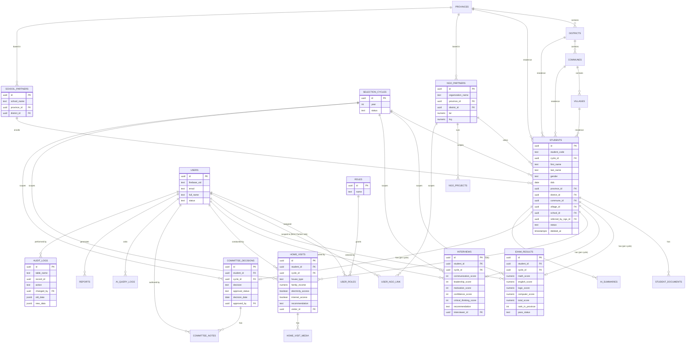

# Database ERD

Full DDL with all columns, constraints, and indexes is in [04-schema.sql](04-schema.sql). This diagram shows entities and relationships; attribute lists are abbreviated to the fields relevant to the relationship.

## Relationship Notes

- **1 student : 1 cycle.** A returning applicant in a later year gets a new `students` row carrying a stable `student_global_id` (UUID, not a PK) so longitudinal history can be queried without violating the cycle-scoped uniqueness of stage tables.
- **Stage tables (`exam_results`, `interviews`, `committee_decisions`) are effectively 1:1 with `students`** (one row per student per cycle), enforced via a `UNIQUE (student_id)` constraint — since `students` itself is already cycle-scoped, this is equivalent to one-per-student-per-cycle.
- **`home_visits` is 1:N** — a student may receive a follow-up/re-visit; the latest visit by `visit_date` is used downstream unless the committee explicitly references an earlier one.
- **Administrative hierarchy** (`provinces → districts → communes → villages`) is a self-contained reference dataset, seeded once (see [seed-data.sql](seed-data.sql)), and reused by `students`, `ngo_partners`, and `school_partners`.
- **`audit_logs` is polymorphic** (`table_name` + `record_id`) rather than FK'd to every table, by design — it must survive even if the source row is hard-deleted (which it never should be — see soft delete strategy in [04-schema.sql](04-schema.sql)).
