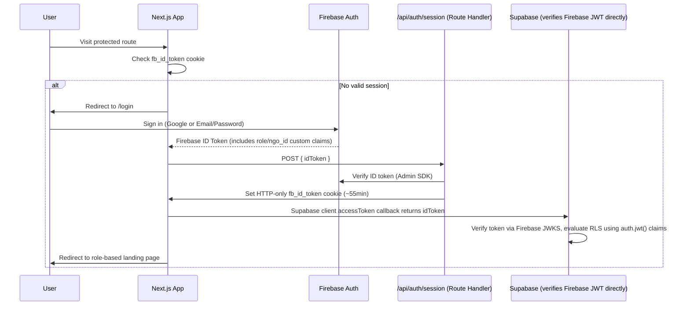

# Security Design

## 1. Authentication Flow

This system uses **Supabase Third-Party Auth** for Firebase: the Supabase project verifies Firebase ID tokens directly (via Firebase's JWKS), so there is no custom token-minting service. Role (`role`) and NGO scope (`ngo_id`) travel as **Firebase custom claims**, set server-side via the Firebase Admin SDK whenever an admin changes a user's role.

- Firebase ID tokens expire hourly; the client SDK auto-refreshes them. `useAuth()` listens via `onIdTokenChanged` and re-POSTs the refreshed token to `/api/auth/session` to keep the server-side cookie current, and the browser Supabase client always pulls the live token from the Firebase SDK (`user.getIdToken()`) for its `accessToken` callback — no token is ever duplicated into a separate Supabase session format.
- The session cookie (`fb_id_token`) is **HTTP-only** (not readable by JS) to mitigate XSS token theft; CSRF risk is mitigated via `SameSite=Lax` + Route Handlers checking `Origin`/`Referer` on state-changing requests.
- New accounts are **admin-invited only** (no public self-signup) — Super Admin creates the `users` row + role first (this also calls the Firebase Admin SDK to set the `role`/`ngo_id` custom claims on that Firebase UID); the invited person's first sign-in (Google or email/password set via Firebase invite link) is matched by email to that pre-created record.
- Whenever a Super Admin changes a user's role or NGO link, the same admin action re-runs `setCustomUserClaims` — the affected user must get a fresh ID token (sign-out/in, or wait for the next hourly refresh) before the new claims take effect, since custom claims are only embedded at token-mint time.

## 2. Role-Based Access Control

### 2.1 Roles (8, fixed enum — see `roles` table)
`super_admin`, `program_manager`, `selection_team`, `interview_team`, `home_visit_team`, `committee_member`, `ngo_partner`, `donor`.

### 2.2 Enforcement layers (defense in depth)
1. **Supabase RLS** ([04-schema.sql](04-schema.sql) §14) — the authoritative layer; even if UI or API checks are buggy, the database itself will not return or accept rows outside the caller's permission.
2. **Next.js Route Handlers** — re-derive role from the verified JWT (never from a request body field) and return 403 before doing any work, as a fast-fail and to avoid leaking timing/error details from RLS-denied queries.
3. **UI gating** (`RoleGate` component, `lib/rbac.ts`) — hides actions/nav items the role can't perform; this is UX only, never the security boundary.

### 2.3 Permission matrix (summary)

| Capability | Super Admin | Program Mgr | Selection Team | Interview Team | Home Visit Team | Committee | NGO Partner | Donor |
|---|---|---|---|---|---|---|---|---|
| Manage users/roles | ✅ | – | – | – | – | – | – | – |
| Create/edit cycles | ✅ | ✅ | – | – | – | – | – | – |
| Create/edit students | ✅ | ✅ | ✅ | – | – | – | – | – |
| Enter exam scores | ✅ | ✅ | ✅ | – | – | – | – | – |
| Enter interview scores | ✅ | ✅ | – | ✅ | – | – | – | – |
| Enter home visit data | ✅ | ✅ | – | – | ✅ | – | – | – |
| Record committee decision | ✅ | ✅ | – | – | – | ✅ | – | – |
| Approve committee decision | ✅ | ✅ | – | – | – | – | – | – |
| View own NGO's students | ✅ | ✅ | ✅ | ✅ | ✅ | ✅ | ✅ (own only) | – |
| View all students (PII) | ✅ | ✅ | ✅ | ✅ | ✅ | ✅ | – | – |
| View aggregate dashboards/map | ✅ | ✅ | ✅ | ✅ | ✅ | ✅ | ✅ | ✅ |
| Generate reports/exports | ✅ | ✅ | ✅ | – | – | ✅ | – (own data only) | – |
| Use AI Data Assistant (row-level) | ✅ | ✅ | ✅ | ✅ | ✅ | ✅ | – (aggregate only) | – (aggregate only) |

Exact RLS policies implementing this matrix are in [04-schema.sql](04-schema.sql) §14; the AI Data Assistant's role-based aggregate-vs-row-level restriction is implemented separately in the `ai_readonly` Postgres role and view layer described in [08-ai-integration.md](08-ai-integration.md) §Feature 4.

## 3. Audit Logging & Activity Tracking

- Every INSERT/UPDATE on `students`, `exam_results`, `interviews`, `home_visits`, `committee_decisions`, `ngo_partners`, `school_partners`, `users` writes to `audit_logs` via trigger (`write_audit_log()`), capturing `changed_by` (from the JWT `sub` claim), full `old_data`/`new_data` snapshots, and whether the action was a soft delete.
- `audit_logs` is readable only by `super_admin`/`program_manager` (RLS policy `audit_admin_only`).
- AI usage is separately logged (`ai_query_logs`, `ai_summaries.generated_by`) for both audit and cost monitoring.
- Login events (success/failure, IP, user agent) are captured via Firebase Authentication's own logs (exportable to BigQuery if longer retention/analysis is needed later) plus a lightweight `login_events` table can be added if in-app visibility is required (see [12-future-enhancements.md](12-future-enhancements.md)).

## 4. Data Encryption

- **In transit**: TLS everywhere — Vercel↔browser, Vercel↔Supabase, Vercel↔Firebase, Vercel↔Anthropic all HTTPS by default; no plaintext fallback.
- **At rest**: Supabase Postgres and Storage are encrypted at rest by the provider. Highly sensitive fields (none currently classified as needing field-level encryption beyond provider-level disk encryption — family income and contact info are sensitive but operationally required in plaintext for the program's core workflow); revisit if the NGO's data policy requires field-level encryption for `family_income_monthly`/`phone`, which can be added via `pgcrypto` `pgp_sym_encrypt` with a server-held key.
- **Secrets**: `ANTHROPIC_API_KEY`, Supabase service role key, Firebase Admin SDK service account JSON, and the Supabase JWT signing secret are stored only in Vercel/Supabase encrypted environment variable stores — never committed, never exposed to the client bundle (enforced by Next.js's server/client module boundary + `import "server-only"` guards).

## 5. File Access Security

- All Supabase Storage buckets (`student-documents`, `home-visit-media`, `reports`) are **private** — no public bucket, no public URLs.
- Access is exclusively via short-lived **signed URLs** (default 5–15 minute expiry), generated server-side only after an RLS-equivalent permission check on the owning record (e.g., before signing a URL for a student's ID card, verify the caller's role/NGO scope can view that student).
- Storage object paths are namespaced by cycle and student id (`cycle/{cycle_id}/students/{student_id}/...`) so a future bucket-policy tightening (e.g., per-province storage policies) can be layered on without renaming objects.
- Uploaded files are validated server-side for MIME type and size (images ≤ 10MB, documents ≤ 20MB) before being written to Storage, rejecting executable/script content types outright.

## 6. Additional Hardening

- **SQL injection**: all application queries go through the Supabase client (parameterized) or PostgREST; the one place raw SQL strings are involved (AI Data Assistant) has the multi-layered validation described in [08-ai-integration.md](08-ai-integration.md).
- **XSS**: React's default escaping + Tailwind/ShadCN components; any AI-generated text rendered as plain text, never `dangerouslySetInnerHTML`.
- **Dependency hygiene**: Dependabot/`npm audit` in CI; pin Supabase/Firebase/Anthropic SDK versions.
- **Least privilege DB roles**: distinct Postgres roles for the app's anon/authenticated PostgREST role, the AI Data Assistant's `ai_readonly` role, and the service role used only inside Edge Functions/Route Handlers — never the same credential for browser-facing and server-only operations.
