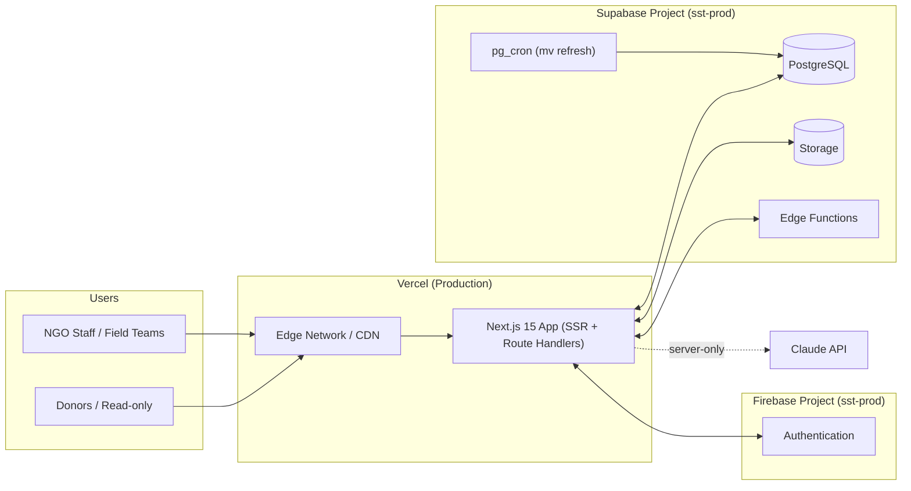

# Deployment Architecture & Guide

## 1. Production Topology



## 2. Environments

| Env | Branch | Vercel | Supabase project | Firebase project | Purpose |
|---|---|---|---|---|---|
| Production | `main` | `scholarship-tracker` | `sst-prod` | `sst-prod` | Live system, real student data |
| Staging | `develop` | `scholarship-tracker-staging` | `sst-staging` | `sst-staging` | UAT before each cycle's rollout, training |
| Preview | per-PR | Vercel preview | `sst-staging` | `sst-staging` | Per-PR review with seeded sample data |

## 3. CI/CD Pipeline

1. **PR opened** → GitHub Actions: lint (`eslint`), typecheck (`tsc --noEmit`), unit tests (`vitest`), Supabase migration dry-run (`supabase db diff` against staging) → Vercel preview deploy.
2. **Merge to `develop`** → auto-deploy to Staging Vercel project + apply pending Supabase migrations to `sst-staging` (`supabase db push`) → smoke test suite (Playwright) runs against staging.
3. **Merge to `main`** (release) → manual approval gate → apply migrations to `sst-prod` first (`supabase db push --project-ref <prod>`) → then deploy Next.js to Production Vercel project. Migrations always precede app deploy so new code never queries a schema that isn't there yet (additive-first migration discipline — never drop a column in the same release that removes its usage).

## 4. Environment Variables (per environment, set in Vercel + Supabase Edge Function secrets)

```
# Public (client-safe)
NEXT_PUBLIC_SUPABASE_URL=
NEXT_PUBLIC_SUPABASE_ANON_KEY=
NEXT_PUBLIC_FIREBASE_API_KEY=
NEXT_PUBLIC_FIREBASE_AUTH_DOMAIN=
NEXT_PUBLIC_FIREBASE_PROJECT_ID=

# Server-only — never exposed to the client bundle
SUPABASE_SERVICE_ROLE_KEY=
SUPABASE_JWT_SECRET=
FIREBASE_ADMIN_SERVICE_ACCOUNT_JSON=
ANTHROPIC_API_KEY=
```

## 5. Database Migrations & Materialized View Refresh

- Schema changes are authored as numbered files under `supabase/migrations/` (the canonical full schema is [04-schema.sql](04-schema.sql); migrations are how it's incrementally applied/evolved in practice).
- `mv_province_stats` is refreshed every 10 minutes via `pg_cron` (`refresh materialized view concurrently mv_province_stats;`) — acceptable staleness for dashboard/map KPIs; a manual "Refresh now" admin action can call the same SQL on demand for verification after a bulk import.

## 6. Storage Buckets

| Bucket | Access | Contents |
|---|---|---|
| `student-documents` | Private, signed URL only | photo, ID card, transcript, certificates |
| `home-visit-media` | Private, signed URL only | house/family photos, visit reports |
| `reports` | Private, signed URL only | generated PDF/Excel/CSV exports |

## 7. Monitoring & Observability

- **Vercel**: built-in analytics + function logs; alert on Route Handler 5xx rate.
- **Supabase**: built-in Postgres logs/metrics; alert on connection pool saturation as student count grows toward 50k+ (consider `pgbouncer` transaction pooling, already default on Supabase).
- **Anthropic usage**: track via `ai_query_logs`/`ai_summaries` row counts + Anthropic console usage dashboard; alert if daily spend exceeds a configured threshold.
- **Uptime**: simple external uptime check (e.g. a scheduled ping to `/api/health`) feeding the Program Manager's monthly ops review.

## 8. Backup & Disaster Recovery

- Supabase automated daily backups (point-in-time recovery on Pro plan) — confirm retention window matches the NGO's data-loss tolerance (recommend ≥30 days given annual-cycle, hard-to-redo field data like home visits).
- Storage objects are backed up as part of the Supabase project backup; additionally export a periodic (e.g. monthly) snapshot of `student-documents` to a separate cold-storage bucket/provider as a second copy, given some documents (ID cards, transcripts) are not re-collectible if lost.
- Documented restore runbook: restore Postgres from PITR target timestamp → re-point Vercel env vars only if project ref changes → verify RLS policies survived restore (they're part of the schema, so they do) → smoke test login + one record of each type.

## 9. Release Checklist (per scholarship cycle)

1. Super Admin creates the new `selection_cycles` row (`status='planning'`) ahead of the IS stage.
2. Confirm GeoJSON + province seed data unchanged (re-verify only if Cambodia's administrative boundaries change).
3. Run staging UAT with field teams before the cycle's exam stage begins (this is when bulk import volume is highest).
4. Flip cycle `status` to `active` when IS intake opens.
5. At cycle close, flip to `closed`, then `archived` after final reporting — archived cycles become read-only via RLS for all non-`super_admin` roles to protect historical integrity.
